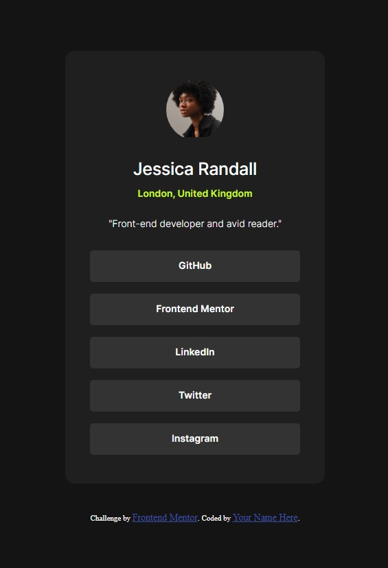

# Social Links Profile: Foundational UI Exercise

This project is a **historical practice** focused on mastering CSS Flexbox and implementing a strict "Mobile-First" workflow. I preserve it in my portfolio as a record of my early steps in creating clean, responsive, and reusable UI components.

---

## 🚀 Demo
[SEE DEMO HERE](https://cmp2007.github.io/social-links-profile/)

### 🏆 Challenge Context
This project was developed as a solution to the [Social links profile challenge on Frontend Mentor](https://www.frontendmentor.io/challenges/social-links-profile-UG32l9m6dQ).

### Screenshot

---

## 📋 Evolution & Context Note
> ⚠️ **Technical Transparency:** This repository was created during my initial learning phase. At that time, I included the original challenge assets (starter files and design guides) within the main branch. Today, I maintain this structure as evidence of my growth in **Git workflow** and my current understanding of professional repository management (such as the use of `.gitignore` to exclude non-essential assets).

## 📋 Technical Milestones of this Stage
In this specific phase of my training, I successfully achieved:

* **Flexbox Stack Architecture:** Implementation of a centralized layout using `display: flex` and `flex-direction: column` to manage the vertical alignment of profile elements and action buttons.
* **Component Styling & Overflows:** Use of `border-radius: 50%` combined with `overflow: hidden` to create a perfect circular avatar, a fundamental skill for profile UI components.
* **Dynamic Hover States:** Development of interactive feedback where the link buttons change background color, text color, and `font-weight` simultaneously, improving the user's affordance.
* **Typography & Contrast:** Integration of the 'Inter' font family with varying weights (`300`, `500`, `600`) to create a clear visual hierarchy between the name, location, and bio.

## 🛠️ Technologies (at the time)
* **HTML5:** Semantic structure using `<main>` and `<article>`.
* **CSS3:** Flexbox layout, media queries, and interactive states.
* **Normalize.css:** Used to ensure cross-browser visual consistency.

---
**Coded by [Carlos Miguel Puche](https://github.com/CMP2007)**
